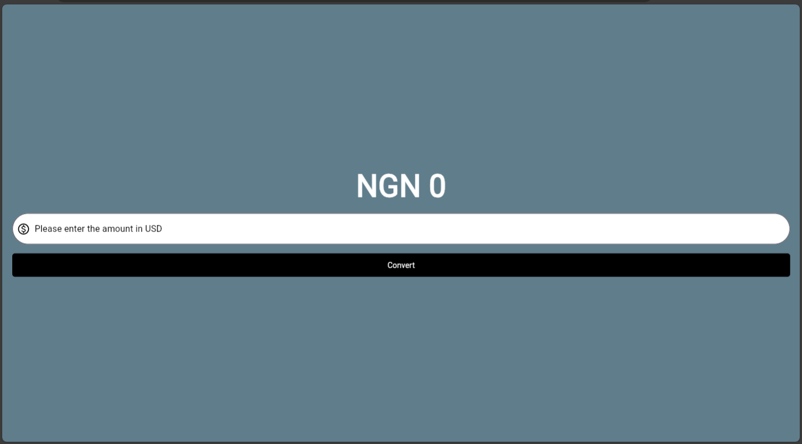
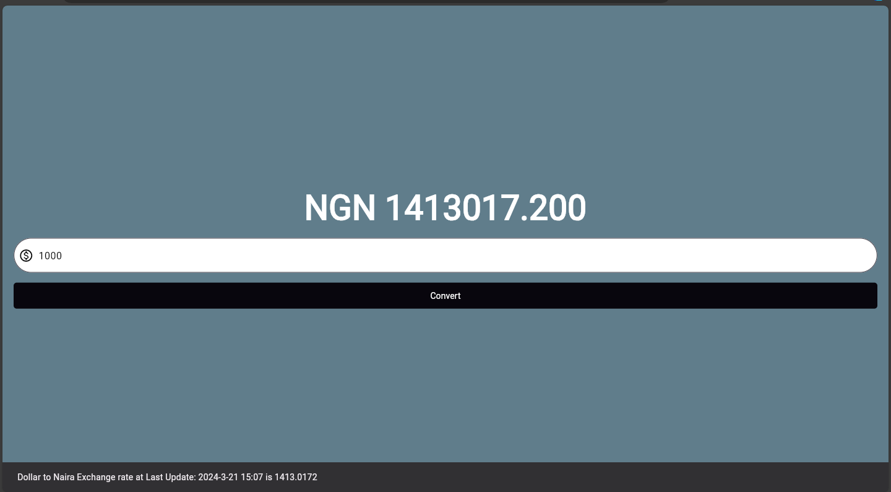

# 💵 Dollar to Naira Converter App

Welcome to the Dollar to Naira Converter app! This project marks my debut in Flutter development, showcasing my grasp of the fundamentals of Flutter.

## Overview
This simple yet powerful app allows users to effortlessly convert their dollar input to its Nigerian Naira equivalent (NGN). With just a few taps, users can access accurate currency conversion right at their fingertips.

## Features
- **User-Friendly Interface:** Utilizing a `TextField`, the app seamlessly collects user input for conversion.
- **Instant Conversion:** The converted amount is displayed on the screen in real-time, providing users with immediate results.
- **Input Validation:** In the event of invalid input, a snackbar prompt guides users to correct their entry, ensuring a smooth user experience.

## Acknowledgements
I owe much of my learning and inspiration for this project to Rivaan's enlightening YouTube video on "The Complete Dart & Flutter Developer Course." His guidance and expertise have been invaluable throughout this journey, and I extend my sincere gratitude to him for sharing his knowledge. 🙏

## Future Enhancements
This project serves as a foundation for future enhancements and refinements. Stay tuned for updates as I continue to expand and improve the functionality and user experience of this app. 🚀

